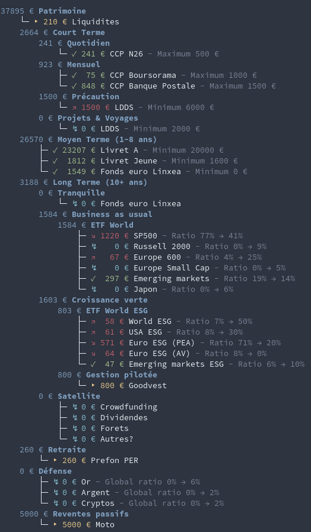

# Finary Assistant :robot:

Finary Assistant is a command-line tool to organize your investments portfolio in a custom structure and get automated monthly investment recommendations based on your future life goals :superhero: 
This tool synchronizes with your [Finary](https://finary.com/) account to show real-time investment values. Don't have Finary yet? Sign up using my [referral link](https://finary.com/referral/f8d349c922d1e1c8f0d2) or through the [default](https://finary.com/signup) page.



## ✨ Features

1. **✅ Portfolio:** Organize your assets, set targets, and sync with your Finary account.
2. **⏳ Analyzer:** Generate global statistics and graphs to understand each line and folder.
3. **⏳ Simulator:** Define your life goals and events, simulate your portfolio's future.
4. **⏳ Assistant:** Get monthly recommendations on where to invest next to meet your goals.
5. **⏳ Optional:** Nice but difficult or time-consuming features. Any volunteers?

You can check the [current development status](./doc/TODO.md) anytime. Contributions are warmly welcome!

## 🚀 Installation
1. Make sure you have python 3.8 or later installed.

2. Clone this repository using the `--recursive` option to include [`finary_api`](https://github.com/lasconic/finary):
```sh
git clone --recursive https://github.com/MadeInPierre/finary_assistant.git
```

3. _(Optional) If you forgot to clone recursively, run this command at the root folder:_
```sh
git submodule update --init --recursive
```
4. Run the install script:
```sh
./install.sh
```
5. Go inside the `lib/finary_api` folder and follow the [setup instructions](https://github.com/lasconic/finary#quick-start). Make sure you have access to your account by running:
```sh
cd lib/finary_api                         # Go to 
cp credentials.json.tpl credentials.json  # Use the template to create credentials.json
nano credentials.json                     # <- Enter your Finary account credentials
python -m finary_api signin               # Sign in and make sure everything works
cd ../..                                  # Go back to finary_assistant
```
6. Run the assistant with `python assistant.py`.

<!-- ```sh
python assistant.py
``` -->

And you're done! You should see a template portfolio tree and your investments detected from Finary. Now go customize the `assistant.py` file for your own needs 🚀

<!-- 1. Install [`finary_api`](https://github.com/lasconic/finary) by following the instructions there and make sure everything works.

```
git submodule add -f https://github.com/lasconic/finary lib/finary_api
```
2. Add the following line at the end of your `.bashrc` (or `.zshrc`) file and relaunch your terminal:

```sh
export PYTHONPATH=/full/path/to/finary:$PYTHONPATH
```

1. Inside `finary_api`, modify the `finary_api/constants.py` file and provide the full path to the credentials and cookies file:

```python
CREDENTIAL_FILE = "/full/path/to/credentials.json"
COOKIE_FILENAME = "/full/path/to/localCookiesMozilla.txt"
```

4. Clone this repository anywhere:

```sh
git clone https://github.com/MadeInPierre/finary_assistant.git
```

5. Install pip dependencies:

```sh
pip install -r requirements.txt
``` -->

## ⚙️ Usage 
The goal is to declare a tree structure of your entire portfolio investments independently from their host envelopes (e.g. PEA, AV, CTO, etc). Define your own asset-based global strategy without feeling constrainted on keeping similar assets in common envelopes. Once your entire portfolio strategy is defined here, find the best envelope for each line and add your envelopes to your Finary account (manual or automatic sync). This project will fetch each line amount from Finary and display your full portfolio with real-time amounts.

To declare your portfolio, create a nested list of `Folder` objects as your structure. Each folder can hold multiple `Line` objects, one for each of your investments. You can define `Target` amounts at each structure level.

#### Example

Here is an example of a portfolio structure:
```python
# Create a list of Lines that will be considered as a single Line.
my_bucket = Bucket([
  Line('My Asset 1', key='name_in_finary'),
  Line('My Asset 2', key='name_in_finary'),
  # ...
])

# Define your entire portfolio structure
portfolio = Portfolio('My Portfolio', children=[
  # Add a list of `Line`, `Folder`, and `SharedFolder` objects
  Folder('Short term', children=[
    Line('My Asset 3', key='name_in_finary'),
    Folder('Stocks', children=[
      # ...
    ]),
    # ...
  ]),
  Folder('Long term', children=[
    SharedFolder('My Folder', bucket=my_bucket, bucket_amount=1000),
    # ...
  ])
])
```

#### Buckets & Shared Folders
Hey

#### Targets
Any node in the tree accepts an optional `target` parameter. Here is an example:

```python
Folder('Stocks', target=TargetMin(2000, tolerance=500), children=[
  Line('ETF World', key='Amundi ETF ...', target=TargetRange(80, tolerance=5)), 
  # ... Other lines with the remaining 20% of the Stocks folder.
])
```

In this case, 

## 👨‍💻 Contributions and requests
This repository is at a very early stage. If you'd like to contribute, please open an issue and ask me to write a detailed documentation! For new features or bug fixes, please fork the repository and use a feature branch. Pull requests as well as [open discussions](https://OPENISSUE) about future features are warmly welcome!

## 📄 License
This project is under the [GPLv3 License](./LICENSE) meaning anyone can use, share, extend, and contribute to this project as long as their changes are integrated to this repo or also published using GPLv3. Please contact me for any specific licensing requests.

## 💌 Donations
[](https://www.buymeacoffee.com/MadeInPierre)
If you found this project useful and wish to support my work, you can [buy me a coffee](https://www.buymeacoffee.com/MadeInPierre)! It would give me the motivation to keep improving this project :smile: Thank you!
